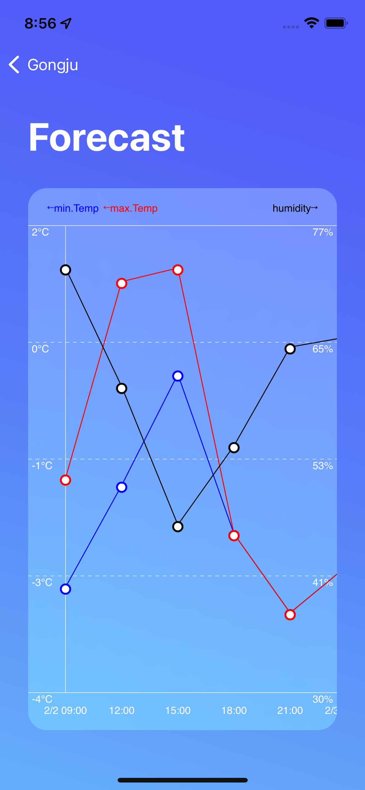

# momo-weather

## What is momo-weather?
- 대한민국 20개 도시의 현재 날씨, 미래 기온을 알려 주는 날씨 정보 어플리케이션 입니다.
- 날씨 정보는 [Open Weather Api](https://openweathermap.org/api)를 통해 얻어온 정보 입니다. 

## Environment
- iOS 15.0

## Dependency
- UIKit, CoreLocation으로만 구성된 iOS 모바일 어플리케이션으로, 사용된 외부 라이브러리는 없습니다.

## Detail
- 3 depth page로 구성되어 있는 어플리케이션 입니다.
1. 날씨 리스트

    
    

    
    - 미리 설정 된 20개 도시의 현재 기온, 날씨, 습도를 살펴 볼 수 있습니다.
    - 각 날씨 별로 픽토그램이 할당 되어 있으며, 이쁜 색상 또한 할당 되어 있습니다.
    - 네비게이션 바에 있는 정렬 아이콘을 통해 `도시이름, 현재기온, 거리`순으로 정렬이 가능 합니다.
    - 정렬 시, 같은 조건을 여러번 선택함으로써 내림차순-오림차순 간 정렬이 가능합니다.
    - 각 도시 사각형 영역을 클릭하면 `2. 날씨 상세` 화면으로 이동합니다.

2. 날씨 상세

    

    - 선택한 도시의 현재 기온, 날씨, 습도 외에도 날씨 설명, 체감온도, 최고-최저온도, 기압, 풍속 등의 상세 정보를 살펴 볼 수 있습니다.
    - 가운데에 있는 `How it would be like in the future?`버튼을 클릭하면 `3. 기온 예보 그래프`화면으로 이동합니다. 
    
3. 날씨 예보 그래프

    

    - 선택한 도시의 3시간 간격 5일동안의 최고-최저 기온, 습도 의 그래프를 살펴 볼 수 있습니다.
    - 좌측 세로축이 나타내는 값은 기온이며 최저기온은 파란색, 최고기온은 빨간색으로 꺾은선 그래프로 표현 되어 있습니다.
    - 오른쪽 세로축이 나타내는 값은 습도이며, 검은색 꺾은선 그래프로 표현 되어 있습니다. 
    - 가로방향 스크롤로 원하는 시간대로 이동 할 수 있습니다.
    - 가로모드가 지원되는 페이지 입니다. 
